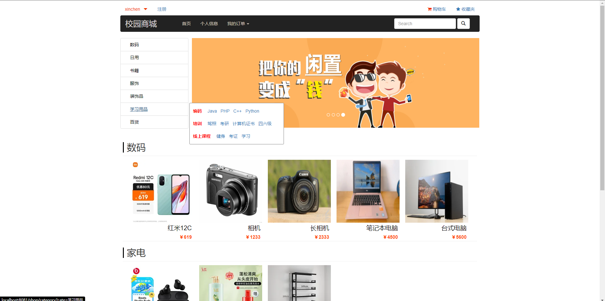

**完整代码收费 +   316595344     或    lz316595344  咨询** 

**接毕业设计和论文**

**如果图片加载不出来可以去博客看 https://blog.csdn.net/qq_56450993/article/details/133357869**

**毕业设计所有选题地址**

**[github]👉https://github.com/XinChennn/allProjects**

**[gitee]👉https://gitee.com/xinchennn/allProjects**

**[忻辰的个人博客]👉https://www.ixinjiu.cn/articles/156**

# 基于Spring Boot的校园二手商城系统

## 一、系统介绍

毕业设计：基于Spring Boot的商城项目，一个简单的商城，界面友好，但是不是很漂亮。实现了商城所有基本功能。

## 二、使用技术

 * 后端： SpringBoot 、Swagger
 * 前端： JSP 
 * 数据库：MySQL
 * 技术语言 jdk 1.8

## 三、环境介绍

基础环境 :IDEA/eclipse， JDK 1.8，Mysql8.0+，Maven

**所有项目以及源代码本人均调试运行无问题，可支持远程调试运行**

## 四、页面截图

## 五、浏览地址

> API接口访问  http://127.0.0.1:8081/shop/swagger-ui.html

> 管理员访问 http://127.0.0.1:8081/shop/admin/login

> 普通用户访问 http://127.0.0.1:8081/shop/

>管理员帐号  admin 12345678

>用户帐号  root 或 xinchen 或 admin  密码均为 12345678

## 六、安装教程

1. 使用Navicat或者其它工具，在mysql中创建对应名称的数据库，然后运行项目的`resource`目录下的sql脚本（询问作者索取）；

2. 使用IDEA/Eclipse导入项目，若为maven项目请选择maven;导入成功后请执行maven clean;maven install命令，然后运行；

3. 修改 `application.yml` 里面的数据库配置

4. 图片保存路径：  可以全局搜索后替换

    windows:  D:/upload

    linux:  /usr/upload

    mac：需要修改代码，见下面已知问题记录. 或者代码全局搜索   // todo mac需要修改地址 

5. 启动后端项目，访问 http://127.0.0.1:8081/shop/

## 七、图片不能显示

 原因：初始图片没有存储，可以在后台添加一个商品，查看图片存储路径:

 windows:D:/upload

 Linux:/usr/upload

**完整代码 +   316595344     或    lz316595344  咨询** 

**接毕业设计和论文**
